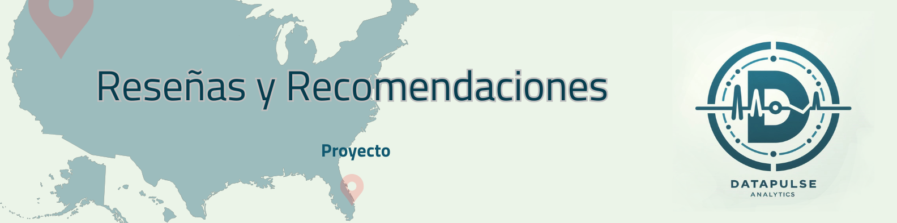
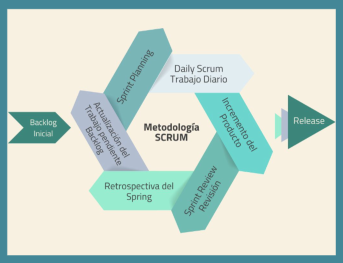
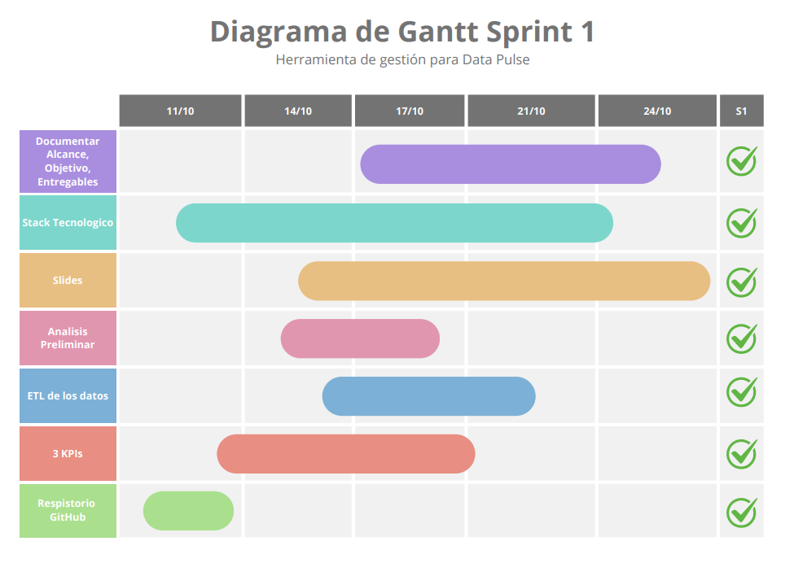
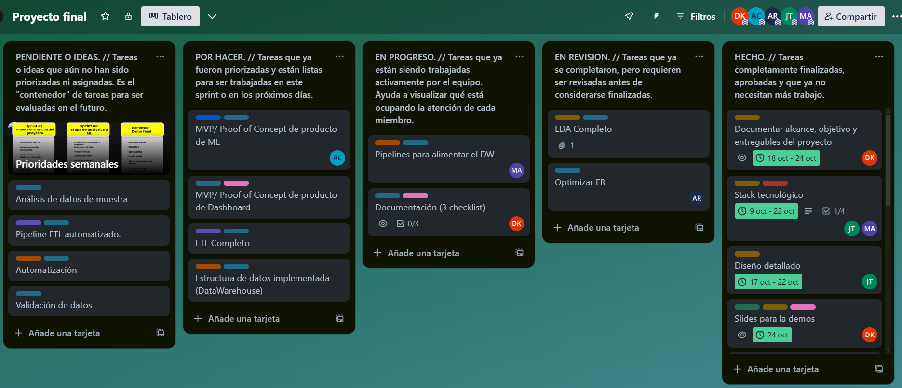

# **PROYECTO GRUPAL**
- - -

## **BREVE DESCRIPCIÓN DEL PROYECTO**

NOMBRE DE LA EMPRESA: **DataPulse Analytics**

Este proyecto se centra en mejorar la efectividad y la practicidad de las estrategias de nuestro cliente, quien es parte de un conglomerado de empresas de restaurantes y afines en Estados Unidos.

*¿Cómo lo haremos?* Realizando un análisis de mercado en una muestra del territorio, con un enfoque exclusivo en el sector gastronómico (restaurantes) en los cinco estados con mayor cantidad de establecimientos de este rubro. 

*¿Cuáles son esos estados?:* California, Nueva York, Florida, Texas y Pennsylvania.

De esta forma buscamos garantizar resultados relevantes y de alta calidad, optimizando el impacto estratégico y dejando una puerta abierta a que el cliente vea, transite y reciba el feedback de los insights hallados para luego, de requerilo, continuar con otra etapa del análisis mas... *'à la carte'* 👨‍🍳 😉

## **MIEMBROS DEL EQUIPO**  👩🏻‍💻 👨🏻‍💻 👩🏼‍💻 👨🏻‍💻 👨🏼‍💻 

## ESTRUCTURA DEL PROYECTO

- `assets/`: Archivos estaticos, imagenes y reportes
- `Notebooks/`: Jupyter notebooks con los análisis en local.
- `src/`: Codigo fuente, modulos de aplicaciones y scripts.
- `README.md`: Documentación
- `requirements.txt`: Requerimientos del proyecto.
- `cloudbuild.yaml`: Conexion del repositorio con Composer.

## **ENTENDIMIENTO DE LA SITUACION ACTUAL**

En la era digital, las opiniones de los usuarios se han convertido en un recurso inestimable para las empresas, especialmente en los sectores de turismo y gastronomía. Las plataformas de reseñas como Yelp y Google Maps permiten a los consumidores compartir sus experiencias de manera rápida y directa, generando un flujo constante de feedback invaluable.

Las empresas están cada vez más conscientes de la importancia de estos datos, no solo para medir su desempeño actual, sino también para identificar áreas de mejora. La percepción del cliente, reflejada en las reseñas, puede influir decisivamente en la reputación y el éxito de un negocio. Además, el análisis de sentimientos en estas opiniones proporciona insights profundos sobre lo que los clientes realmente valoran y lo que no, permitiendo ajustes estratégicos basados en datos reales.

Por otro lado, la integración de las reseñas en servicios de localización como Google Maps amplifica su alcance e impacto. Los usuarios dependen de estas opiniones para tomar decisiones informadas sobre dónde comer, alojarse y disfrutar de diversas actividades. Esto convierte las reseñas en un factor crucial para la planificación de estrategias de mercado y ubicación.

En resumen, las empresas deben continuar aprovechando estas herramientas para mantenerse competitivas, adaptándose rápidamente a las necesidades y expectativas cambiantes de los clientes. El análisis y la utilización efectiva de este feedback puede marcar la diferencia entre estancarse o crecer en un mercado cada vez más exigente.

### Problemática

Las empresas enfrentan desafíos al interpretar y utilizar el flujo constante de reseñas de usuarios en plataformas como Yelp y Google Maps. La incapacidad para analizar estas opiniones en tiempo real puede resultar en decisiones desinformadas y en la falta de adaptación a las necesidades y expectativas cambiantes de los clientes. Esta desconexión afecta la competitividad y el crecimiento en mercados exigentes y en rápida evolución.

Nuestro proyecto busca abordar esta problemática mediante el análisis de reseñas y opiniones para proporcionar insights estratégicos, permitir la integración de datos en tiempo real y optimizar la toma de decisiones basadas en datos precisos y actualizados.

## **OBJETIVOS DEL PROYECTO** 

1. Predecir cuáles serán los rubros de negocios que más crecerán o decaerán en el mercado.

2. Identificar las mejores ubicaciones para nuevos locales basándose en la densidad de competidores y la demanda 
de usuarios.

3. Implementar un sistema de recomendación personalizado para que los usuarios de Yelp y Google Maps descubran nuevos
 comercios basados en sus experiencias previas.

4. Generar herramientas de visualización que presenten los hallazgos de manera clara y accionable para el cliente.

5. Desarrollar un sistema que actualice la información en tiempo real, permitiendo que las reseñas de Yelp y Google Maps se integren automáticamente en los análisis. 

De esta forma se podrá  ayudar a nuestro cliente a tomar decisiones estratégicas informadas sobre su presencia en el mercado y 
sus estrategias futuras.

### *Alcance Inmediato* 🏁 

En esta etapa del proyecto, (el mísmo puede en un futuro y a pedido del cliente, expandirse), daremos un enfoque exclusivo en el sector gastronómico, pues consideramos que centrarnos
en este pilar turístico puede ser clave para la efectividad y la practicidad del proyecto, garantizando la relevancia, calidad y 
utilidad de los resultados, optimizando el impacto estratégico para el cliente, y tomando como muestra a los cinco estados del territorio de EEUU que, según los datos obtenidos, poseen la mayor cantidad de comercios de los rubros antes mencionados.

¿Cuáles son esos estados? **California, New York, Florida, Texas y Pennsylvania**

#### *Motivos*
- - -

**Relevancia del Cliente:** Dado que nuestro cliente pertenece a un conglomerado de empresas de restaurantes y afines, es fundamental 
centrarse en sectores directamente relacionados con su núcleo de negocio para obtener insights más relevantes y accionables.

**Impacto Económico:** Este sector representa una parte significativa de la industria del turismo y ocio, y es especialmente ensibles a las opiniones de los clientes. Un análisis exhaustivo puede tener un impacto directo en la estrategia de negocios y en la rentabilidad.

**Viabilidad del Proyecto:** Enfocarse en un ámbito más estrecho permite una gestión más eficaz y manejable del proyecto, asegurando que los recursos disponibles se utilicen de manera óptima.

**Claridad en la Implementación del Sistema de Recomendación:** Al limitar el alcance, el desarrollo del sistema de recomendación puede ser más preciso y efectivo, personalizando mejor las experiencias de los usuarios basadas en sus reseñas previas.

**Tendencias del Mercado:** Restaurantes suelen reflejar tendencias y cambios en el comportamiento del consumidor de manera más inmediata que otros sectores, permitiendo una rápida adaptación y estrategia de mercado.

#### *Datos que respaldan la elección de nuestro alcance*
- - - 
(gráficos del EDA que justifiquen la elección de los 5 estados)

## DATOS Y FUENTES

- Los archivos crudos con la información acerca de Google Maps y Yelp se encuentran en la siguiente ruta de Google Drive:
[Enlace a Drive]("https://drive.google.com/drive/folders/1Wf7YkxA0aHI3GpoHc9Nh8_scf5BbD4DA")
- Diccionario de datos: [Enlace al Diccionario de Datos]("assets/Diccionario_de_datos-PF.xlsx")

## PROCESO DEL PROYECTO

### 1. Descarga de Datos
- **Fuente**: Los datos se descargan desde Google Drive.
- **Formato Inicial**: Los archivos están en formato JSON, PKL, PARQUET.

### 2. Transformación de Datos
- **Conversión de Formato**: Los archivos JSON Y PKL se convierten a formato Parquet para optimizar el almacenamiento y el procesamiento.
- **Librerías Utilizadas**: `pandas`, `pyarrow`.

### 3. ETL (Extract, Transform, Load)
- **Extracción**: Se extraen los datos de los archivos Parquet.
- **Transformación**: Se realizan limpiezas, normalización de datos y eliminación de duplicados.
- **Carga**: Los datos transformados se cargan en una base de datos en BigQuery.
- **Librerías Utilizadas**: `pandas`, `google-cloud-bigquery`.

### 4. Análisis Exploratorio de Datos (EDA)
- **Objetivo**: Obtener un entendimiento preliminar de los datos, identificar patrones y definir el alcance del análisis.
- **Técnicas**: Estadísticas descriptivas, visualizaciones iniciales.
- **Herramientas Utilizadas**: `pandas`, `matplotlib`, `seaborn`.

### 5. Creación de Base de Datos en BigQuery
- **Configuración**: Configuración y creación de esquemas en BigQuery.
- **Carga de Datos**: Carga de los datos transformados a BigQuery para un procesamiento y análisis más eficientes.

### 6. Desarrollo de Prototipos de Dashboard
- **Equipo**: Análisis de datos.
- **Herramientas**: Power BI.
- **Objetivo**: Crear dashboards interactivos que visualicen los insights obtenidos de los datos.

### 7. Preparación del Modelo de Recomendación
- **Equipo**: Ciencia de datos, machine learning.
- **Algoritmos Utilizados**: Sistemas de recomendación (Collaborative Filtering, Content-Based Filtering).
- **Librerías Utilizadas**: `scikit-learn`, `tensorflow`.

### 8. Despliegue del Modelo
- **Framework**: FastAPI para la creación de APIs.
- **Visualización**: Streamlit para crear una interfaz web interactiva que permita a los usuarios finales interactuar con el modelo de recomendación.

## Tecnologías Utilizadas
- **Python**: Principal lenguaje de programación.
- **Pandas**: Para la manipulación y análisis de datos.
- **BigQuery**: Para el almacenamiento y procesamiento de datos en la nube.
- **Airflow**: Para la automatización de tareas y flujos de trabajo.
- **Google Composer**: Para la orquestación de flujos de trabajo con Airflow.
- **Power BI**: Para la creación de dashboards interactivos.
- **Scikit-learn/TensorFlow**: Para el desarrollo de modelos de machine learning.
- **FastAPI**: Para el despliegue de APIs.
- **Streamlit**: Para la visualización de datos en una interfaz web.
- **Lucidchart**: plataforma en línea para la creación de diagramas de forma colaborativa.
(INSERTAR LOGOS)

## KPI´s 📈

- **KPI: Identificación de Baches de Accesibilidad**

Objetivo: Encontrar los estados en donde los negocios con accesibilidad sean inferiores al x% del total de negocios de ese rubro, indicando áreas con potencial de inversión para mejorar la accesibilidad.

Métrica: Porcentaje de negocios accesibles en cada estado comparado con el total de negocios de ese rubro.

- **KPI: Satisfacción del Cliente en Relación a Reseñas**

Objetivo: Identificar los estados en donde hay comercios con alta cantidad de reseñas pero con bajo rating (baja satisfacción del cliente en zonas de alta concurrencia) indicando oportunidad de inversión.

Métrica: Cantidad de reseñas vs. rating promedio de comercios en cada estado.

- **KPI: Tendencia de Crecimiento en Subcategorías**

Objetivo: Buscar subcategorías en las que en relación a la densidad de reseñas del trimestre anterior haya aumentado un x%, indicando una tendencia en alza y oportunidad de crecimiento en ese rubro.

Métrica: Incremento porcentual en la densidad de reseñas por subcategoría respecto al trimestre anterior.

## **METODOLOGÍA DE TRABAJO** 

**METODOLOGÍA SCRUM**: Scrum es un marco de trabajo ágil para el desarrollo de productos que permite a equipos de trabajo abordar problemas complejos de forma eficiente, creativa y aportando el máximo de valor.

Se propone una estructura basada en ciclos iterativos llamados «Sprints». Estos representan el motor de la creación incremental del producto, siempre en constante evolución, siempre manteniendo al cliente en el centro y generando valor en cada paso.

Cada Sprint consta de cinco fases fundamentales para fomentar la comunicación y la transparencia durante el desarrollo de producto/servicio. Cada una de estas fases Scrum tiene un propósito claro: **ayudarnos a trabajar con eficiencia, mejorar el conocimiento del equipo y potenciar la eficacia en el futuro.** Estas son:

1.  **Reunión de planificación del Sprint (Sprint Planning Meeting):** Servirá para definir el objetivo del Sprint (Sprint Goal) y el trabajo a realizar durante el sprint (Sprint Backlog). En ella participan todos los miembros del Equipo, ya que aquí se consensua y se comprometen a cumplir con el objetivo y trabajo asignado en el plazo establecido.

2.  **Sprint** Es el nombre que recibe cada ciclo que va a haber dentro del desarrollo del un producto/servicio. Es un evento que se realiza en un período corto de tiempo, durante el cual el equipo trabaja para crear un incremento del producto «Terminado» utilizable y desplegable. 

Los Sprints permiten dividir el desarrollo del producto en ciclos, siendo cada ciclo un Sprint (Sprint Planning, Daily Meeting, Sprint Review, Sprint Retrospective), proporcionando al final de cada uno un **incremento de Producto**.

La utilización de iteraciones en forma de Sprints permite priorizar en todo momento aquella parte el desarrollo del producto que más valor va a aportar en ese momento, alineándose siempre con las necesidades del cliente o del negocio.

3.  **Scrums diarios (Daily Scrum):** Estos scrums diarios o dailys agilizan las comunicaciones y consiguen centrarse en el tiempo el desarrollo: es aquí donde se detectan los obstáculos que impiden el avance del desarrollo, ayudan a la toma de decisiones que favorezcan el cumplimiento de los tiempos y la consecución del objetivo, a la vez que se consigue que el equipo de desarrollo vaya conociendo a fondo todos los detalles del desarrollo.

4.  **Revisión del Sprint (Sprint Review):** Es una reunión informal que se realiza al finalizar el Sprint en la que se presenta el desarrollo realizado y se proponen nuevas cosas potenciando así la colaboración entre todos. El resultado del Sprint Review es un **Product Backlog** revisado que define los elementos del Product Backlog que probablemente estarán en el próximo Sprint Backlog.

5.  **Retrospectiva del Sprint (Sprint retrospective):** Aquí se aprovecha para inspeccionar el trabajo realizado por el equipo y proponer mejoras para aplicar a los siguientes Sprint. Es una oportunidad para inspeccionarse a sí mismo y de crear un plan de mejoras hacia el futuro.

### **OTROS MÉTODOS DE ORGANIZACIÓN**  📊
- - - 

## Diagrama de Gantt

**Visualización de Cronograma**: Muestra el cronograma del proyecto de manera clara, destacando las tareas y sus tiempos.

**Gestión del Tiempo**: Ayuda a identificar los hitos importantes y las dependencias entre tareas, optimizando la gestión del tiempo.

**Detección de Problemas**: Facilita la detección temprana de retrasos y acumulaciones de tareas, permitiendo acciones correctivas rápidas.

## Trello

**Organización**: Permite organizar tareas en tableros, listas y tarjetas, manteniendo el proyecto ordenado.

**Colaboración**: Facilita la colaboración entre miembros del equipo, permitiendo asignar tareas, adjuntar archivos y comentar.

**Flexibilidad**: Ofrece una visión general del progreso y permite ajustes rápidos, adaptándose a los cambios del proyecto.

## **CONTACTO**

- Aliskair Rodríguez: 
- Débora Kellenberger: 
- Julieta Trimarchi:
- Mauricio Arce:
- Agustín Cáceres: 

