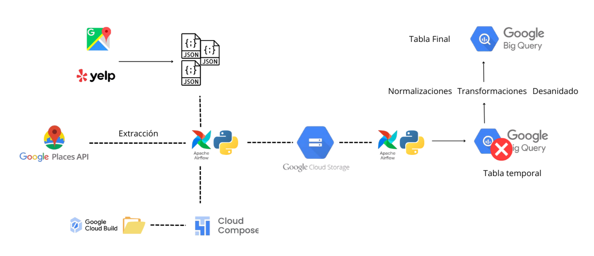
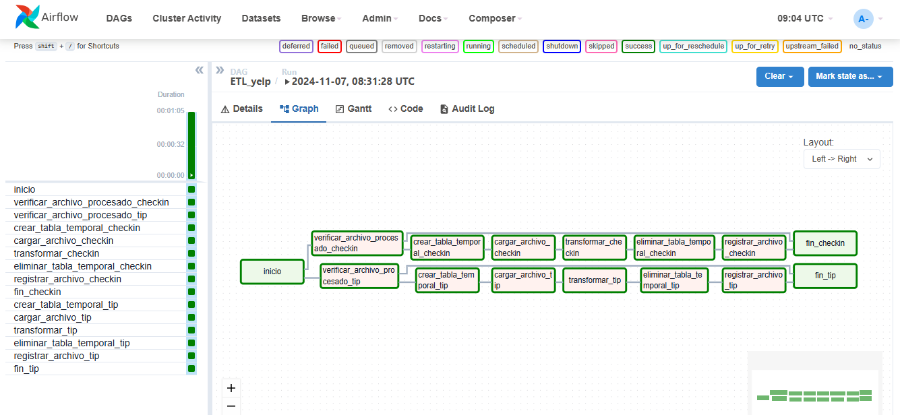

# Pipeline ETL de Yelp y Google en Airflow 🚀

## Introducción 📝

Este proyecto implementa un pipeline **ETL (Extracción, Transformación, Carga)** automatizado utilizando **Google Cloud Platform (GCP)** y **Apache Airflow**. El objetivo es procesar y cargar datos de Yelp y Google en BigQuery sin intervención manual, asegurando que los datos estén limpios y listos para el análisis.

Actualmente, el pipeline procesa los datos desde un Bucket en Cloud Storage, almacenándolos en tablas temporales en BigQuery antes de realizar transformaciones adicionales y cargar los datos en tablas finales semanal o diariamente.

## Arquitectura y Tecnologías utilizada.  💻

- **`Google Cloud Platform (GCP)`**:
  - **BigQuery** para el almacenamiento y procesamiento de datos estructurado.
  - **Google Cloud Storage** para almacenar los archivos fuente sin estructurar.
  - **Google Cloud Build** para sincronizar y automatizar los DAGs y las functions desde el repositorio hacia Composer.
  - **Google Composer** para administrar la arquitectura de Airflow.
  - **Google API Places** para carga incremental de nuevos datos.
- **`Apache Airflow`**: Orquestación del pipeline ETL.
- **`Python`**: Desarrollo de funciones auxiliares y transformación de datos.

## Estructura del Pipeline 📂
- **DAGs**:
  - `DAG_api.py`: Contiene la orquestación ETL de la carga incremental de nuevos datos desde API Places.
  - `DAG_yelp.py`: Contiene la orquestación de los datos de Yelp.
  - `DAG-Googl.py`: Contiene la orquestación de los datos de Google.
- **Functions**:
  - `extract_data_yelp.py`: Funciones para la extracción de datos desde Google Cloud Storage para los archivos de Yelp.
  - `transform_data_yelp.py`: Gestiona las transformaciones específicas para cada archivo de datos, con funciones adaptadas para `checkin.json`y `tip.json`.
  - `load_data_yelp.py`: Incluye funciones para cargar los datos en BigQuery y gestionar las tablas de Yelp.
  - `google_bigquery.py`: Incluye funciones para la creación, eliminación y gestión de las tablas en Bigquery de los datos de Google.
  - `desanidar_columnas.py`: Incluye funciones para el desanidado de las columnas que serán nuevas tablas, en los datos de Google.
  - `etl_api.py`: Incluye funciones para la extracción, transformación y carga incremental de nuevos datos desde la API Places de Google hacia nuevas tablas en BigQuery.
  

## Diagrama y flujo de los DAGs 📊

### **``Flujo Yelp DAG:``**
Este diagrama muestra cómo el flujo del DAG se adapta para diferentes archivos (checkin y tip) y cómo se asegura la modularidad y flexibilidad en el procesamiento con una carga incremental de archivos semanales.

- **Inicio**:
  - `inicio`: Un `DummyOperator` que marca el comienzo del DAG para facilitar la visualización en Airflow.
- **Verificación de Archivos Procesados**:
  - `verificar_archivo_procesado`: Utiliza `BranchPythonOperator` para verificar si el archivo ya fue procesado consultando la tabla de control en BigQuery.
- **Creación de Tablas Temporales**:
  - `crear_tabla_temporal`: Crea tablas temporales en BigQuery para almacenar los datos con el esquema adecuado.
- **Extracción y Transformación de Datos**:
  - `cargar_archivo_en_tabla_temporal`: Extrae los archivos desde Google Cloud Storage (GCS), aplica transformaciones necesarias y carga los datos en las tablas temporales en BigQuery.
- **Transformación en BigQuery y Carga en Tablas Finales**:
  - `transformar_checkin` y `transformar_tip`: Transforman los datos en las tablas temporales y los cargan en las tablas finales `checkin_yelp` y `tip_yelp`.
- **Eliminación de Tablas Temporales**:
  - `eliminar_tabla_temporal`: Elimina las tablas temporales después de cargar los datos en las tablas finales para optimizar el uso de recursos.
- **Registro en la Tabla de Control**:
  - `registrar_archivo_procesado`: Registra el archivo como procesado en la tabla de control para evitar reprocesamiento.
- **Fin**:
  - `fin_checkin` y `fin_tip`: `DummyOperator` que marca el final de cada flujo para `checkin.json` y `tip.json`.

### **``Flujo Google DAG:``**
Este diagrama muestra cómo se desanidan los datos en distintas tablas estructuradas y se aplican normalizaciones en tablas temporales para trasladarlo limpio a la tabla original cada semana.

### **``Flujo API Incremental DAG:``**
vender un poco de humo y especificar que es automatico cada tanto tiempo (ejemplo cada mes). Insertar imagen tambien

## Funcionalidades y Detalles Técnicos ⚙️

- **Control de Archivos ya procesados**: El pipeline verifica si cada archivo ha sido procesado anteriormente consultando una tabla de control en BigQuery. Esto evita procesamientos duplicados de archivos hacia las tablas.
- **Modularización del Código**: Las funciones de extracción, transformación y carga están organizadas en módulos independientes para mejorar la claridad y la reutilización del código.
- **Diccionario de Transformaciones**: En `transform_data_yelp.py`, el diccionario `transformaciones` asocia cada archivo con su respectiva función de transformación, facilitando la extensión del pipeline a otros archivos. Solo se necesita crear una función de transformación y añadirla al diccionario.
- **Documentación de funciones y tareas**: Cada función y tarea dentro del DAG está documentada utilizando docstrings conforme a las buenas prácticas de PEP 8, facilitando su comprensión y mantenimiento.
- **Carga incremental automatica**: Realiza la carga de datos de forma automatizada, ejecutándose semanal y mensualmente sin intervención manual.

## Próximos Pasos 🔜

- **Optimización del Procesamiento de Nuevas Versiones de Archivos**:
  - Implementar una estrategia para detectar cambios en archivos existentes en el bucket de GCS, permitiendo la actualización de versiones de los datasets.
- **Automatización para Otros Datasets**:
  - Extender el pipeline para procesar otros archivos de Yelp y Google, agregando sus transformaciones específicas al diccionario `transformaciones`.
- **Monitoreo y Alertas**:
  - Implementar alertas y notificaciones en caso de fallos en alguna de las tareas del DAG, utilizando los servicios de Airflow y GCP.

## Posibles Mejoras y Consideraciones Futuras 🌟

- **Optimización de Transformaciones en BigQuery**:
  - A medida que se agreguen más datos, puede ser necesario optimizar las consultas de transformación en BigQuery para reducir costos y tiempo de procesamiento.
- **Versionado de Código y Datos**:
  - Considerar el uso de herramientas de control de versiones para el código y el manejo de versiones de datasets en GCS para mantener un historial claro y facilitar el rollback.

## Notas Finales 📝

Este markdown documenta el progreso actual del pipeline y proporciona una guía sobre la arquitectura, el flujo de trabajo y las consideraciones clave. Se actualizará para reflejar nuevos desarrollos y decisiones de diseño a medida que avancemos en el proyecto.

